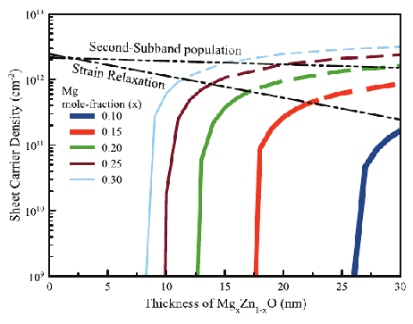

## OXIDEHEMT - Numerical optimization of MgxZn1-xO/ZnO and BexZn1-xO/ZnO based heterostructure transistors
### Project Information
* Date: May 2012 - Apr 2013
* Funded by: Project Supported by Higher Education Institution (Gazi Univ)
* Number: 05/2012-13
* Budget: 14 899 Turkish liras

### Project Description

**Abstract**

In this study, we are planning to investigate the potentials and band structures of  MgxZn1-xO/ZnO and BexZn1-xO/ZnO heterostructures with the help of 1-dimensional non-linear self consistent solutions of Schrödinger and Poisson equations. With the obtained quantum well structures, we will calculate the concentration of electrons, electron probabilities and we will implement quasi-1D approximation to get the current-voltage characteristics of the investigated transistor structures. Results will be compared with the GaN-based counterparts.

### Objectives

In this project, we are considering the optimization of MgxZn1-xO/ZnO and BexZn1-xO/ZnO structures with 1-dimensional non-linear self-consistent Schrödinger-Poisson equation solutions. In these optimization studies, many situations such as the addition of different layers with different alloy ratios, the application of different barrier possibilities, and doping will be discussed. As a result, the Current-Voltage behaviors of the proposed structures will be examined with quasi1D analyzes as transistors, and possible transistor structures will be suggested.

### Project Consortium

#### Project Team
* Assoc. Prof. Dr. Sefer Bora Lisesivdin (PI) (Gazi Univ.)
* Dr. Beyza Lisesivdin (Gazi Univ.)
* Gokhan Atmaca

#### Other Colleagues, Students and Collaborations
* Prof. Dr. Mehmet Kasap (Gazi Univ.)

### Project Structure
n/a

### Project News*

#### October 2014
* New article from project: G. Atmaca, P. Narin, B. Sarikavak-Lisesivdin, S. B. Lisesivdin, M. Kasap "Electron Transport Properties of Two Dimensional Electron Gas in BexZn1-xO/ZnO Heterostructures" Philos. Mag. 95, 79 (2015).

#### September 2013
* P. Narin, G. Atmaca, B. Sarikavak-Lisesivdin, S. B. Lisesivdin, M. Kasap, "A Numerical Investigation on Electronic Properties of Two Dimensional Electron Gas in BexZn1-xO/ZnO Heterostructures", Turkish Physical Society 30th International Physics Congress, p529 (2013).

#### May 2013
* Project is finished.

#### November 2012
* New article from project: B. Sarikavak-Lisesivdin "Numerical optimization of two-dimensional electron gas in MgxZn1-xO/ZnO heterostructures (0.10 < x < 0.30)" Philos. Mag. 93, 1124 (2013).

#### May 2012
* Project is started.

*: Project site is prepared after project was finished.
